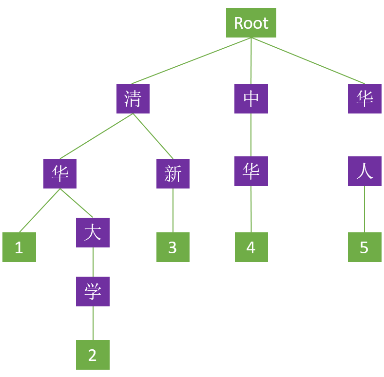

# radix
Radix树一般用于长整数到对象的映射
> 对于长整型数据的映射。怎样解决Hash冲突和Hash表大小的设计是一个非常头疼的问题。
> 利用radix树能够依据一个长整型（比方一个长ID）高速查找到其相应的对象指针。这比用hash映射来的简单，也更节省空间，使用hash映射hash函数难以设计，不恰当的hash函数可能增大冲突，或浪费空间

# Trie(字典树) 
https://segmentfault.com/a/1190000008877595
一般用于字符串到对象的映射，Trie 树中文名叫字典树、前缀树

> trie树主要问题是树的层高。假设要索引的字的拼音非常长非常变态，我们也要建一个非常高非常变态的树么？
radix树能固定层高（对于较长的字符串，能够用数学公式计算出其特征值，再用radix树存储这些特征值）

这个树里面每一个方块代表一个节点，其中 ”Root” 表示根节点，不代表任何字符；紫色代表分支节点；绿色代表叶子节点。除根节点外每一个节点都只包含一个字符。从根节点到叶子节点，路径上经过的字符连接起来，构成一个词。而叶子节点内的数字代表该词在字典树中所处的链路（字典中有多少个词就有多少条链路），具有共同前缀的链路称为串。除此之外，还需特别强调 Trie 树的以下几个特点：

具有相同前缀的词必须位于同一个串内；例如“清华”、“清新”两个词都有“清”这个前缀，那么在 Trie 树上只需构建一个“清”节点，“华”和“新”节点共用一个父节点即可，如此两个词便只需三个节点便可存储，这在一定程度上减少了字典的存储空间。

Trie 树中的词只可共用前缀，不可共用词的其他部分；例如“中华”、“华人”这两个词虽然前一个词的后缀是后一个词的前缀，但在树形上必须是独立的两条链路，而不可以通过首尾交接构建这两个词，这也说明 Trie 树仅能依靠公共前缀压缩字典的存储空间，并不能共享词中的所有相同的字符；当然，这一点也有“例外”，对于复合词，可能会出现两词首尾交接的假象，比如“清华大学”这个词在上例 Trie 树中看起来似乎是由“清华”、“大学”两词首尾交接而成，但是叶子节点的标识已经明确说明 Trie 树里面只有”清华“和”清华大学“两个词，它们之间共用了前缀，而非由“清华”和”大学“两词首尾交接所得，因此上例 Trie 树中若需要“大学”这个词则必须从根节点开始重新构建该词。

Trie 树中任何一个完整的词，都必须是从根节点开始至叶子节点结束，这意味着对一个词进行检索也必须从根节点开始，至叶子节点才算结束。

