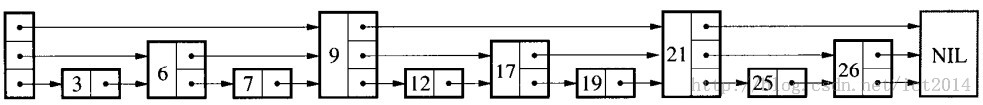

https://blog.csdn.net/lz710117239/article/details/78408919

## 基本概念

        跳跃表是一种随机化的数据结构，在查找、插入和删除这些字典操作上，其效率可比拟于平衡二叉树（如红黑树），大多数操作只需要O(log n)平均时间，但它的代码以及原理更简单。跳跃表的定义如下：

        “Skip lists are data structures  that use probabilistic  balancing rather than  strictly  enforced balancing. As a result, the algorithms for insertion and deletion in skip lists  are much simpler and significantly  faster  than  equivalent  algorithms for balanced trees.”

        译文：跳跃表使用概率平衡，而不是强制平衡，因此，对于插入和删除结点比传统上的平衡树算法更为简洁高效。 

        跳跃表基于有序单链表，在链表的基础上，每个结点不只包含一个指针，还可能包含多个指向后继结点的指针，这样就可以跳过一些不必要的结点，从而加快查找、删除等操作。如下图就是一个跳跃表
        
        

  传统的单链表是一个线性结构，向有序的链表中插入、查找一个结点需要O(n)的时间。如果使用上图的跳跃表，就可以减少查找所需的时间。

        跳跃表的插入和删除操作都基于查找操作，理解了查找操作，也就理解了跳跃表的本质。查找就是给定一个key，查找这个key是否出现在跳跃表中。

        结合上图，如果想查找19是否存在，从最高层开始，首先和头结点的最高层的后继结点9进行比较，19大于9，因此接着和9在该层上的后继结点21进行比较，小于21，那这个值肯定在9结点和21结点之间。

        因此，下移一层，接着和9在该层上的后继结点17进行比较，19大于17，然后和21进行比较，小于21，此时肯定在17结点和21结点之间。

        接着下移一层，和17在该层上的后继结点19进行比较，这样就最终找到了。

 

        上面就是跳跃表的基本思想，跳跃表结点包含多少个指向后继元素的指针，是通过一个随机函数生成器得到的。这就是为什么论文“Skip Lists : A Probabilistic Alternative to Balanced Trees ”中有“概率”的原因了，就是通过随机生成一个结点中指向后续结点的指针数目。